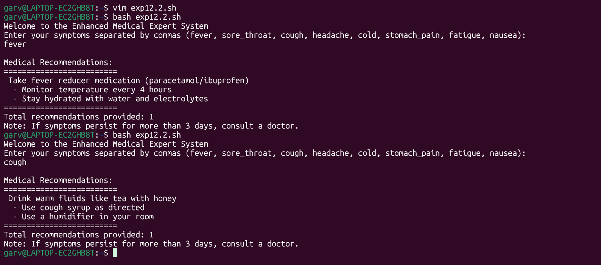
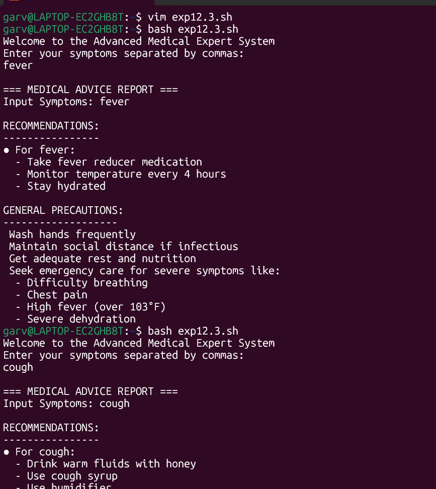

## Experiment [12]: [Expert system using shell scripting]
### Name: Astik Patel, Roll No: 590029070 Date: 2025-11-17

### AIM:
* [To learn Basics of Shell programming]
* [Building a Rule-Based Expert System using Shell scripting]

### Requirement:
* [Any linux distro, any kind of text editor (vs code, vim, notepad, nano,etc)]

### Theory:
# Process Automation and Job Scheduling
* cron - Time-based job scheduler for repetitive tasks

* Edit user crontab with crontab -e
```bash
 Syntax: minute hour day month dayofweek command
 Example: 0 9 * * * /home/user/backup.sh executes daily at 9 AM
```
     at - One-time job scheduling

* Schedule commands to run once at specific time
```bash
Example: echo "backup.sh" | at 2:00 AM tomorrow
```

System Administration Scripts
Automation scripts for routine system management:

* Backups - Regular data backup and archiving
* User Management - Automated user creation and permission setup
* Log Monitoring - Real-time log analysis and alert generation
* System Health Checks - Resource monitoring and maintenance

Services and Daemons
System service management using systemctl:

* systemctl start service - Start a service.
* systemctl stop service - Stop a  service.
* systemctl status service - Check service status.
* systemctl enable service - Enable auto-start at boot.
* systemctl disable service - Disable auto-start.


## procedure & observations
## Lab:
# 1.
## Task statement: 
* [Create a shell script named "expert_system.sh"]
* [implement a set of rules using conditional statements (if-elif-else) within the script.Each rule should check for specific conditions and provide a corresponding recommendation]

## command(s):
```bash
#!/bin/bash
echo "Welcome to the Medical Expert System"
echo "Enter your symptoms (fever, sore_throat, cough, headache, cold, stomach_pain):"
read symptoms

if [[ "$symptoms" == *"fever"* ]]; then
    echo "Recommendation: Take fever reducer medication and rest."
fi
if [[ "$symptoms" == *"sore_throat"* ]]; then
    echo "Recommendation: Gargle with warm saltwater and stay hydrated."
fi
if [[ "$symptoms" == *"cough"* ]]; then
    echo "Recommendation: Drink warm fluids and take cough syrup."
fi
if [[ "$symptoms" == *"headache"* ]]; then
    echo "Recommendation: Rest in a quiet room and consider pain relief medication."
fi
if [[ "$symptoms" == *"cold"* ]]; then
    echo "Recommendation: Get plenty of rest and use decongestants if needed."
fi
if [[ "$symptoms" == *"stomach_pain"* ]]; then
    echo "Recommendation: Avoid solid foods initially and drink clear fluids."
fi

if [[ "$symptoms" != *"fever"* && "$symptoms" != *"sore_throat"* && "$symptoms" != *"cough"* && "$symptoms" != *"headache"* && "$symptoms" != *"cold"* && "$symptoms" != *"stomach_pain"* ]]; then
    echo "General Recommendation: Consult a doctor for accurate diagnosis."
fi

```

## output:
<p align="center">

</p>

# 2. Example Rules:
## Task statement:
* [If the user is experiencing fever, recommend taking a fever reducer medication]
* [If the user has a sore_throat, recommend gargling with warm saltwater]
* [If the user has a cough and congestion, recommend drinking warm fluids and taking cough syrup]
* [If user has a headache recommend Rest in a dark, quiet room]
* [If user has a cold recommend Get a plenty of rest and sleep]
* [If user has a stomach_pain recommend Avoid solid foods for few hours]
* [If user has a fatigue recommend Maintain balanced diet with iron-rich foods]
* [If user has a nausea recommend Drink ginger tea or peppermint tea]

# command(s):
```bash
#!/bin/bash
echo "Welcome to the Enhanced Medical Expert System"
echo "Enter your symptoms separated by commas (fever, sore_throat, cough, headache, cold, stomach_pain, fatigue, nausea):"
read symptoms

symptoms_lower=$(echo "$symptoms" | tr '[:upper:]' '[:lower:]')

echo ""
echo "Medical Recommendations:"
echo "========================="


recommendation_count=0

if [[ "$symptoms_lower" == *"fever"* ]]; then
    echo " Take fever reducer medication (paracetamol/ibuprofen)"
    echo "  - Monitor temperature every 4 hours"
    echo "  - Stay hydrated with water and electrolytes"
    ((recommendation_count++))
fi

if [[ "$symptoms_lower" == *"sore_throat"* ]]; then
    echo " Gargle with warm saltwater 3 times daily"
    echo "  - Use throat lozenges for temporary relief"
    echo "  - Avoid cold drinks and smoking"
    ((recommendation_count++))
fi

if [[ "$symptoms_lower" == *"cough"* ]]; then
    echo " Drink warm fluids like tea with honey"
    echo "  - Use cough syrup as directed"
    echo "  - Use a humidifier in your room"
    ((recommendation_count++))
fi

if [[ "$symptoms_lower" == *"headache"* ]]; then
    echo " Rest in a dark, quiet room"
    echo "  - Apply cold compress to forehead"
    echo "  - Consider pain relief medication if severe"
    ((recommendation_count++))
fi

if [[ "$symptoms_lower" == *"cold"* ]]; then
    echo " Get plenty of rest and sleep"
    echo "  - Use saline nasal spray for congestion"
    echo "  - Take vitamin C supplements"
    ((recommendation_count++))
fi

if [[ "$symptoms_lower" == *"stomach_pain"* ]]; then
    echo " Avoid solid foods for few hours"
    echo "  - Drink clear fluids (water, broth)"
    echo "  - Apply warm compress to abdomen"
    ((recommendation_count++))
fi

if [[ "$symptoms_lower" == *"fatigue"* ]]; then
    echo " Ensure 7-8 hours of quality sleep"
    echo "  - Maintain balanced diet with iron-rich foods"
    echo "  - Practice light exercise like walking"
    ((recommendation_count++))
fi

if [[ "$symptoms_lower" == *"nausea"* ]]; then
    echo " Drink ginger tea or peppermint tea"
    echo "  - Eat small, frequent meals"
    echo "  - Avoid strong smells and fatty foods"
    ((recommendation_count++))
fi

echo "========================="
if [ $recommendation_count -eq 0 ]; then
    echo "No specific symptoms recognized."
    echo "General Advice: Consult a healthcare professional for proper diagnosis."
else
    echo "Total recommendations provided: $recommendation_count"
    echo "Note: If symptoms persist for more than 3 days, consult a doctor."
fi
```

## output:

# 3.
## Task Statement:
* [prompt the user to input their symptoms]
* [If none of the rules match the user's symptoms, provide a general recommendations]
* [Test the expert system by running the script and providing different sets of symtoms to observe the recommendations]

## command(s):
```bash
#!/bin/bash
echo "Welcome to the Advanced Medical Expert System"
echo "Enter your symptoms separated by commas:"
read symptoms

symptoms_lower=$(echo "$symptoms" | tr '[:upper:]' '[:lower:]' | tr ',' ' ')
declare -A recommendations
declare -a matched_symptoms

recommendations["fever"]="Take fever reducer medication|Monitor temperature every 4 hours|Stay hydrated"
recommendations["sore_throat"]="Gargle with warm saltwater|Use throat lozenges|Avoid cold drinks"
recommendations["cough"]="Drink warm fluids with honey|Use cough syrup|Use humidifier"
recommendations["headache"]="Rest in dark room|Apply cold compress|Consider pain relief"
recommendations["cold"]="Get plenty of rest|Use saline nasal spray|Take vitamin C"
recommendations["stomach_pain"]="Avoid solid foods|Drink clear fluids|Apply warm compress"
recommendations["fatigue"]="Ensure 7-8 hours sleep|Eat iron-rich foods|Light exercise"
recommendations["nausea"]="Drink ginger tea|Eat small frequent meals|Avoid strong smells"

echo ""
echo "=== MEDICAL ADVICE REPORT ==="
echo "Input Symptoms: $symptoms"
echo ""


for symptom in "${!recommendations[@]}"; do
    if [[ " $symptoms_lower " == *" $symptom "* ]]; then
        matched_symptoms+=("$symptom")
    fi
done


if [ ${#matched_symptoms[@]} -gt 0 ]; then
    echo "RECOMMENDATIONS:"
    echo "----------------"
    for symptom in "${matched_symptoms[@]}"; do
        echo "● For $symptom:" 
        IFS='|' read -ra advice <<< "${recommendations[$symptom]}"
        for item in "${advice[@]}"; do
            echo "  - $item"
        done
        echo ""
    done
else
    echo "No specific symptoms recognized."
    echo "General Advice: Consult a healthcare professional."
fi


echo "GENERAL PRECAUTIONS:"
echo "-------------------"
echo " Wash hands frequently"
echo " Maintain social distance if infectious"
echo " Get adequate rest and nutrition"
echo " Seek emergency care for severe symptoms like:"
echo "  - Difficulty breathing"
echo "  - Chest pain" 
echo "  - High fever (over 103°F)"
echo "  - Severe dehydration"

```
## output:



# 4.
## Task Statement:
* [modify the rules match the user's symptoms, provide different sets of symptoms to observe the recommendation]
* [Document the logic and rules implemented in the script, along with any modifications or additions made]

## Explanation:
## Documentation Report:
* System Overview: The rule-based medical expert system provides preliminary health recommendations based on user-reported symptoms using pattern matching and conditional logic.


* Rules and Logic: 
1. Input Processing: Case-insensitive symptom matching using string comparison.

 2. Rule Structure: IF-THEN rules for each symptom-recommendation pair.

 3. Multiple Recommendations: Support for concurrent multiple symptom analysis.

 4. Default Handling: General medical advice for unrecognized symptoms

Symptom-Recommendation Mapping:

* Fever - Medication, temperature monitoring, hydration
* Sore Throat - Saltwater gargle, lozenges, avoid irritants
* Cough - Warm fluids, cough syrup, humidifier
* Headache - Rest, cold compress, pain relief
* Cold - Rest, nasal spray, vitamin C
* Stomach Pain - Dietary adjustment, fluids, warm compress
* Fatigue - Sleep optimization, nutrition, light exercise
* Nausea - Ginger tea, meal management, odor avoidance

# Summary:
1. Enhanced Symptom Coverage: Added 3 new symptoms (headache, cold, stomach pain) plus fatigue and nausea. 
2. Multiple Recommendation Display: Implemented array-based system to handle concurrent symptoms.
3. Structured Output: Organized recommendations with bullet points and categories. 
4. Cron Integration: Automated daily execution capability. 
5. User Experience: Case-insensitive input, clear formatting, general precautions.
6. Error Handling: Default advice for unrecognized inputs.


# Technical Implementation:

* Bash string manipulation for pattern matching.
* Associative arrays for symptom-recommendation storage.
* Cron scheduling for automation.
* Modular rule structure for easy expansion.

# Challenges faced:
* Syntax error 
* creating Extra information
* making a script normal - enhanced - Advanced version with more detailing.
